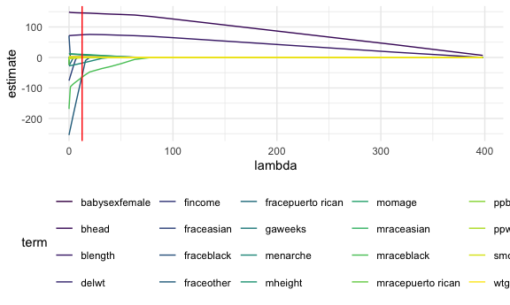
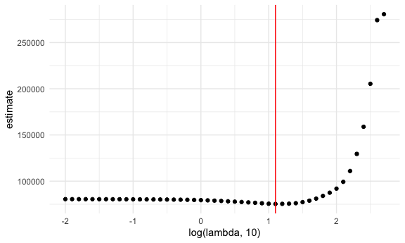
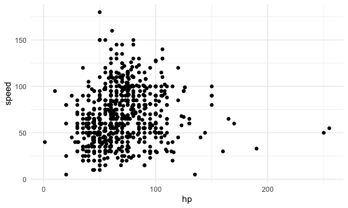
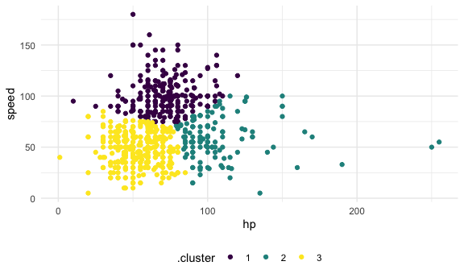

Statistical learning
================
Ravi Brenner
2024-11-21

``` r
library(tidyverse)
```

    ## ── Attaching core tidyverse packages ──────────────────────── tidyverse 2.0.0 ──
    ## ✔ dplyr     1.1.4     ✔ readr     2.1.5
    ## ✔ forcats   1.0.0     ✔ stringr   1.5.1
    ## ✔ ggplot2   3.5.1     ✔ tibble    3.2.1
    ## ✔ lubridate 1.9.3     ✔ tidyr     1.3.1
    ## ✔ purrr     1.0.2     
    ## ── Conflicts ────────────────────────────────────────── tidyverse_conflicts() ──
    ## ✖ dplyr::filter() masks stats::filter()
    ## ✖ dplyr::lag()    masks stats::lag()
    ## ℹ Use the conflicted package (<http://conflicted.r-lib.org/>) to force all conflicts to become errors

``` r
library(glmnet)
```

    ## Loading required package: Matrix
    ## 
    ## Attaching package: 'Matrix'
    ## 
    ## The following objects are masked from 'package:tidyr':
    ## 
    ##     expand, pack, unpack
    ## 
    ## Loaded glmnet 4.1-8

``` r
set.seed(12345)

knitr::opts_chunk$set(
  fig.width = 6,
  fig.asp = .6,
  out.width = "90%"
)

theme_set(theme_minimal() + theme(legend.position = "bottom"))

options(
  ggplot2.continuous.colour = "viridis",
  ggplot2.continuous.fill = "viridis"
)

scale_colour_discrete = scale_colour_viridis_d
scale_fill_discrete = scale_fill_viridis_d
```

## Try Lasso regression

import and clean data

``` r
bwt_df <- read_csv("data/birthweight.csv") |> 
  janitor::clean_names() |>
  mutate(
    babysex = case_match(babysex,
                         1 ~ "male",
                         2 ~ "female"),
    babysex = fct_infreq(babysex),
    frace = case_match(frace,
                       1 ~ "white",
                       2 ~ "black", 
                       3 ~ "asian",
                       4 ~ "puerto rican",
                       8 ~ "other"),
    frace = fct_infreq(frace),
    mrace = case_match(mrace,
                       1 ~ "white",
                       2 ~ "black",
                       3 ~ "asian", 
                       4 ~ "puerto rican",
                       8 ~ "other"),
    mrace = fct_infreq(mrace)) |> 
  sample_n(200)
```

    ## Rows: 4342 Columns: 20
    ## ── Column specification ────────────────────────────────────────────────────────
    ## Delimiter: ","
    ## dbl (20): babysex, bhead, blength, bwt, delwt, fincome, frace, gaweeks, malf...
    ## 
    ## ℹ Use `spec()` to retrieve the full column specification for this data.
    ## ℹ Specify the column types or set `show_col_types = FALSE` to quiet this message.

Contruct inputs for `glmnet`

``` r
x = model.matrix(bwt ~., data = bwt_df)[,-1]
y = bwt_df |> pull(bwt)
```

fit lasso for several lambdas

``` r
lambda = 10^seq(-2, 2.75, by = 0.1)

lasso_fit <- glmnet(x = x, y = y, lambda = lambda)

lasso_cv <- cv.glmnet(x = x, y = y, lambda = lambda)

lambda_opt = lasso_cv[["lambda.min"]]
```

usual lasso plot

``` r
lasso_fit |>
  broom::tidy() |>
  filter(term != "(Intercept)") |>
  select(term, lambda, estimate) |>
  complete(term, lambda, fill = list(estimate = 0)) |>
  ggplot(aes(x = lambda, y = estimate, group = term, color = term)) + 
  geom_line() +
  geom_vline(xintercept = lambda_opt, color = "red")
```



``` r
final_lasso_fit <- glmnet(x = x, y = y, lambda = lambda_opt)

final_lasso_fit |>
  broom::tidy()
```

    ## # A tibble: 12 × 5
    ##    term         step  estimate lambda dev.ratio
    ##    <chr>       <dbl>     <dbl>  <dbl>     <dbl>
    ##  1 (Intercept)     1 -6139.      12.6     0.767
    ##  2 bhead           1   146.      12.6     0.767
    ##  3 blength         1    74.3     12.6     0.767
    ##  4 delwt           1     2.24    12.6     0.767
    ##  5 fincome         1     0.418   12.6     0.767
    ##  6 fraceother      1   -59.0     12.6     0.767
    ##  7 gaweeks         1     8.50    12.6     0.767
    ##  8 menarche        1   -18.5     12.6     0.767
    ##  9 momage          1     9.99    12.6     0.767
    ## 10 mraceblack      1   -64.8     12.6     0.767
    ## 11 smoken          1    -1.34    12.6     0.767
    ## 12 wtgain          1     2.62    12.6     0.767

Look at CV results

``` r
lasso_cv |>
  broom::tidy() |>
  ggplot(aes(x = log(lambda,10), y = estimate)) +
  geom_point() +
  geom_vline(xintercept = log(lambda_opt,10), color = "red")
```



## Cluster pokemons

``` r
pokemon_df = 
  read_csv("data/pokemon.csv") |> 
  janitor::clean_names() |> 
  select(hp, speed)
```

    ## Rows: 800 Columns: 13
    ## ── Column specification ────────────────────────────────────────────────────────
    ## Delimiter: ","
    ## chr (3): Name, Type 1, Type 2
    ## dbl (9): #, Total, HP, Attack, Defense, Sp. Atk, Sp. Def, Speed, Generation
    ## lgl (1): Legendary
    ## 
    ## ℹ Use `spec()` to retrieve the full column specification for this data.
    ## ℹ Specify the column types or set `show_col_types = FALSE` to quiet this message.

``` r
pokemon_df |>
  ggplot(aes(x = hp, y = speed)) + 
  geom_point()
```



Use K-means to cluster these pokemon

``` r
kmeans_fit <- kmeans(x = pokemon_df, centers = 3)
```

Plot these results

``` r
pokemon_df <- 
  broom::augment(kmeans_fit, pokemon_df)

pokemon_df |>
  ggplot(aes(x = hp, y = speed, color = .cluster)) + 
  geom_point()
```


